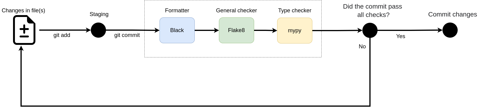

# Code convention

### General

* No method without proper docstrings.
* We use [Google Docstring](https://google.github.io/styleguide/pyguide.html#38-comments-and-docstrings) convention for code documentation.
* Methods must rely on variable annotation using `typing`.
* `PEP 8` is assumed as the basic Style Guide for code.
* Markdown files must have one sentence per row.
* Lines should not have more than 100 characters.
* We enforce the use of [Black](https://github.com/psf/black) as the code formatter.
* We enforce the use of [Flake8](https://flake8.pycqa.org/en/latest) as the static code verification tool.

### Linting hooks

We use pre-commit hooks to guarantee the standard of the code. You can use it by:
```console
pip install pre-commit
cd facedetectionapp
pre-commit install --hook-type pre-commit --hook-type pre-push
```

## Quality checks

Before any merge on the master branch, all automatic tests must pass.

You can manually run them with the following command:

```shell
$ cd facedetectionapp
$ source ./env/bin/activate
(base)$ make pre-commit
```

However, the tests will be ran automatically before any commit. The following operations are performed before the commit
1. Run black to automatic format the code
2. Run flake8 to verify if the code is according to pep8 style Guide for Python Code
3. Run mypy to check the type hints in code

The figure below illustrate the checks performed 



### Commit convetion
We adopt the [Conventional Commits 1.0.0](https://www.conventionalcommits.org/en/v1.0.0/) 

### Git Branching Naming Convention
