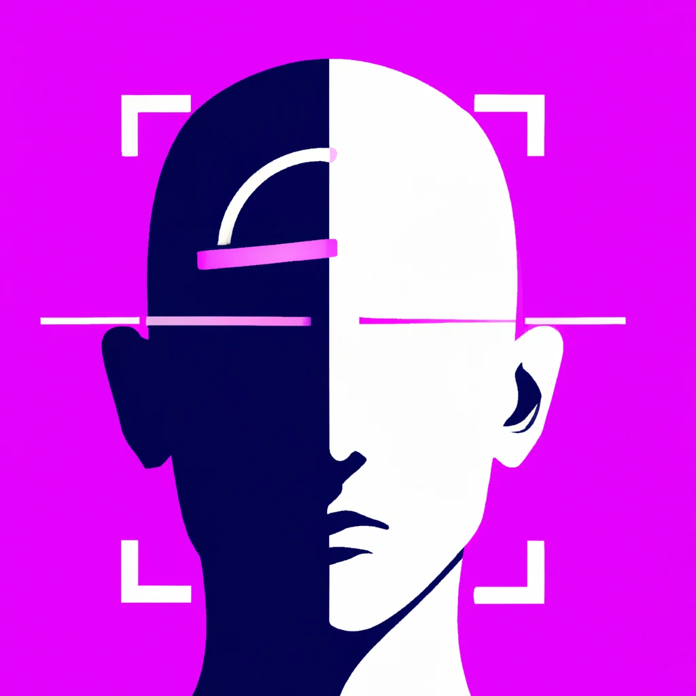

# Face detection webservice

<html>
<p align="center">
    
</p>
</html>

## Installation
```bash
# Clone the repo
git clone https://github.com/deangelign/facedetectionapp.git 
cd facedetectionapp

# Create standalone miniforge (an Anaconda alternative) environment, but any other Python environment should also work
curl -L -O "https://github.com/conda-forge/miniforge/releases/latest/download/Miniforge3-$(uname)-$(uname -m).sh"
bash Miniforge3-$(uname)-$(uname -m).sh -b -p $PWD/env
source env/bin/activate

# Install python 3.10.12
conda install python=3.10.12

# Install facedetectionapp package in editable mode and its requirements
# Editable mode might be useful in the future to locate packages from an upcoming submodules
python -m pip install -e .
```

## Project Structure

```lua
/facedetectionapp
|-- src/
  |-- facedetectionapp/
    |-- insightface_wrapper.py
    |-- main.py
    |-- sandbox.py
|-- tests/
  |-- unit/
    |-- facedetectionapp/
      |-- test_main.py
|-- Dockerfile
|-- CODE_CONVENTION.md
|-- License.md
|-- Makefile.md
|-- README.md
|-- requirements.txt
|-- setup.py
```

## Start the face detection web service
```bash
uvicorn src.facedetectionapp.main:app --reload --host "0.0.0.0" --port 5000
```

## API swagger documentation
After start the service, you can read the documentation at [http://0.0.0.0:5000/docs](http://0.0.0.0:5000/docs) 

## Quick Example
Please checkout the file [sandbox.py](src/facedetectionapp/sandbox.py) to see some examples

if you ran 
```bash
python src/facedetectionapp/sandbox.py
```
All endpoints are used, and two artifacts are generated in this process: "landmarks.jpg" and "crop.jpg"


## Run unit tests
```bash
python -m unittest discover test/
```

## Docker container
* It is required to install Docker engine. Follow the [installation instruction in the Docker official page](https://docs.docker.com/engine/install/)
```bash
docker build -t face-detection-service .
docker run -p 5000:5000 face-detection-service
```


